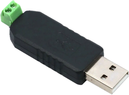

# Home Assistant integration for XY Screens projector screens and projector lifts

[![GitHub Release][releases-shield]][releases]
[![BuyMeCoffee][buymecoffee-shield]][buymecoffee]

# Introduction

Home Assistant integration to control XY Screens projector screens and projector lifts over the
RS-485 interface.

XY Screens is an OEM manufacturer of projector screens and projector lifts.

## Features

- Installation/Configuration through Config Flow UI
- Set the up and down time of your projector screen/lift.
- Position the screen/lift on any position along the way.

## Hardware

I use a cheap USB RS-485 controller to talk to the projector screen where position 5 of the RJ25
connector is connected to D+ and position 6 to the D-.

See the documentation of your specific device on how to wire yours correctly.

## Known to work

- iVisions Electro M Series projector screens

Not tested but uses the same protocol according to the documentation:
- iVisions Electro L/XL/Pro/HD Series
- iVisions PL Series projector lift
- Elite Screens
- KIMEX
- DELUXX

Please let me know if your projector screen or projector lift works with this
integration so I can improve the overview of supported devices.

## Caution

This integration follows the Cover Entity where open means retracting the screen and close opens
the screen, like how rolling blinds, garage doors and curtains work. For a projector screen this is
counter intuitive.

## Installation

### HACS

The recomended way to install this Home Assistant integration is using by [HACS][hacs]. Click the following button to open the integration directly on the HACS integration page.

[][my-hacs]

- Go to your **HACS** view in Home Assistant and then to **Integrations**
- Select **+ Explore & download repositories** and search for *XY Screens projector screens and projector lifts*
- Select **Download**
- Restart Home Assistant

### Manually

- Copy the `custom_components/xyscreens` directory of this repository into the
`config/custom_components/` directory of your Home Assistant installation
- Restart Home Assistant

##  Adding a new XY Screens projector screen or projector lift

- After restarting go to **Settings** then **Devices & Services**
- Select **+ Add integration** and type in **XY Screens**
- Select the serial port or enter the path manually
- Select the type of device, projector screen or projector lift
- Set the up and down times of your device.
- Select **Submit**

A new XY Screens integration and device will now be added to your Integrations
view.

Do you enjoy using this Home Assistant integration? Then consider supporting
my work:\
  

---

[buymecoffee]: https://www.buymeacoffee.com/rrooggiieerr
[buymecoffee-shield]: https://img.shields.io/badge/buy%20me%20a%20coffee-donate?style=for-the-badge
[hacs]: https://hacs.xyz
[my-hacs]: https://my.home-assistant.io/redirect/hacs_repository/?owner=rrooggiieerr&repository=homeassistant-xyscreens&category=integration
[releases-shield]: https://img.shields.io/github/v/release/rrooggiieerr/homeassistant-xyscreens?style=for-the-badge
[releases]: https://github.com/rrooggiieerr/homeassistant-xyscreens/releases